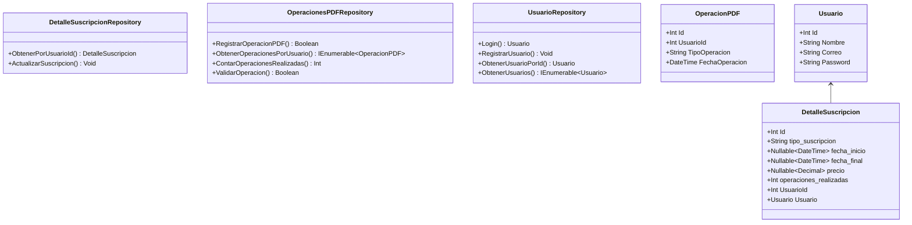
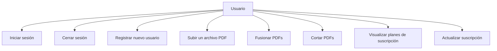
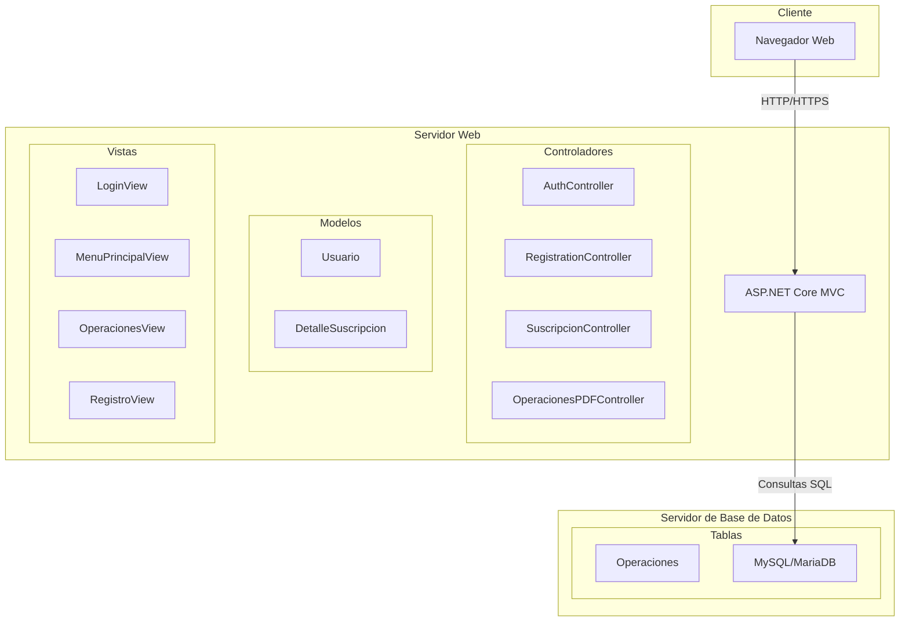
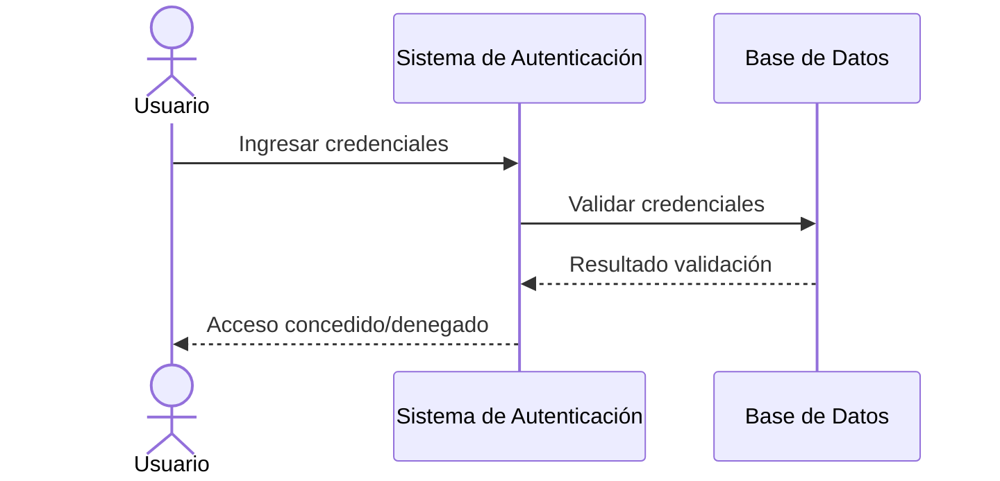
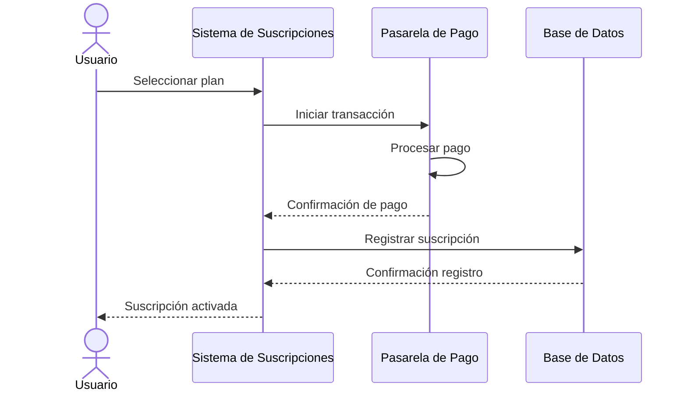
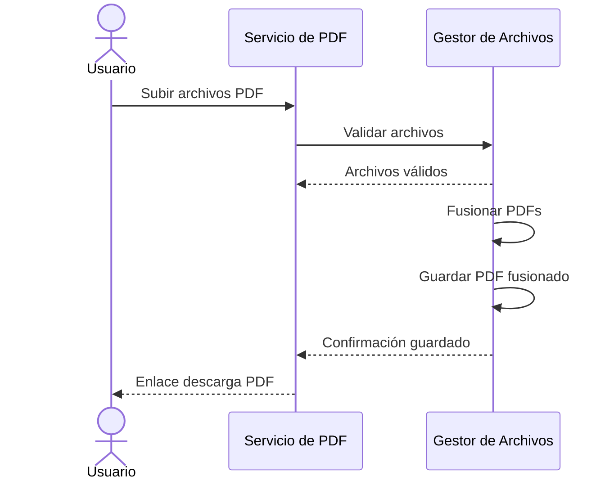
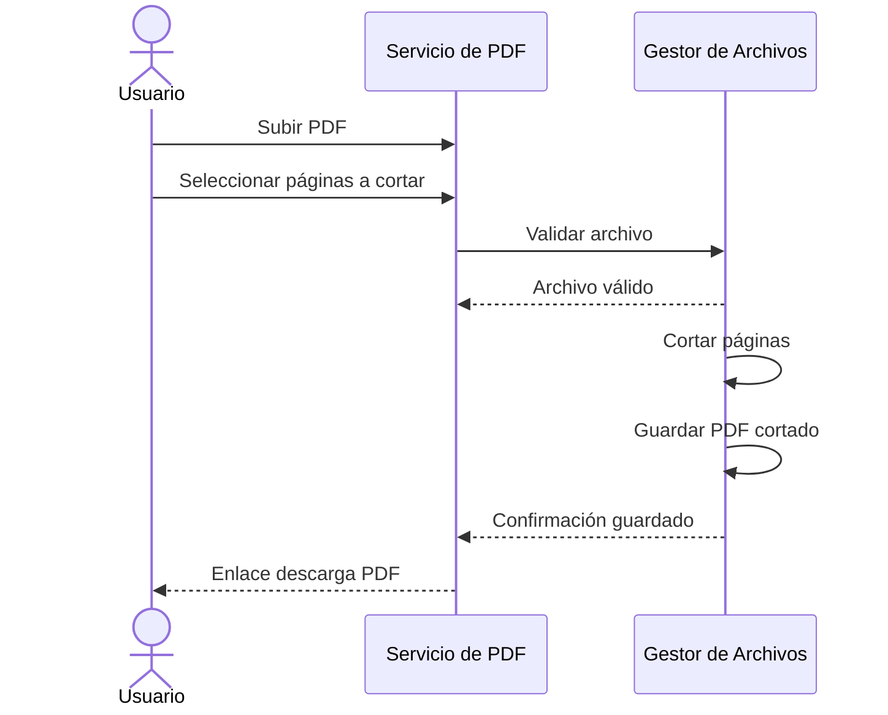
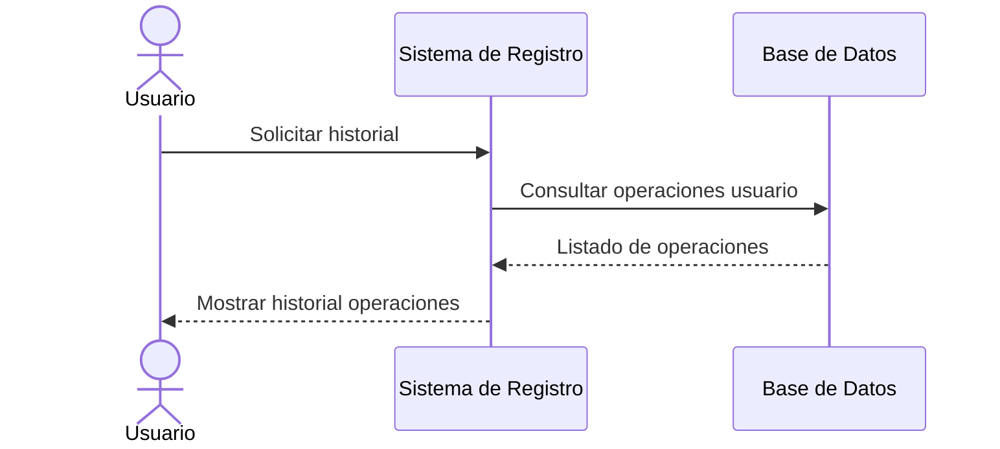
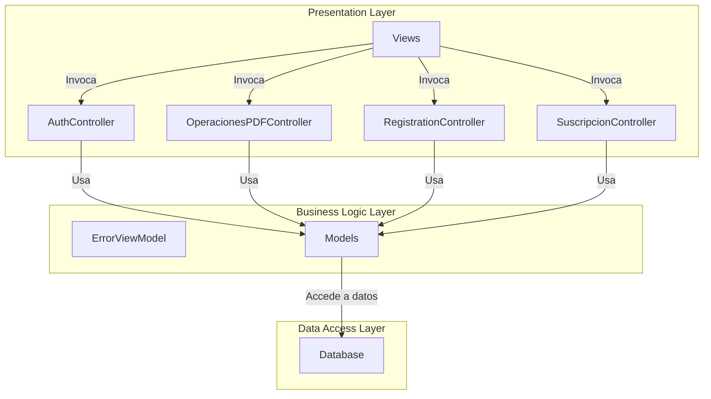

Diagrama de clases

Diagrama de Casos de Uso

Diagrama de Componentes

```mermaid
graph LR
    subgraph PROYECTOPDF
        PCORE[PROYECTOPDF.dll]
        MSASPNET[Microsoft.AspNetCore.Mvc.dll]
        PDFSHARP[PDFSharp.dll]
        MSRELATIONAL[Microsoft.EntityFrameworkCore.Relational.dll]
        PANELSENTITY[Panels.EntityFrameworkCore.MyPag.dll]
        MSTOOLS[Microsoft.EntityFrameworkCore.Tools.dll]
    end

    subgraph NegocioPDF.Tests
        MOQLIB[Moq.dll]
        NEGOPDFTEST[NegocioPDF.Tests.dll]
        NEGOPDF[NegocioPDF.dll]
        GENERICCOL[Generic.collector.dll]
        DAPPER[Dapper.dll]
        MSCORE[Microsoft.EntityFrameworkCore.dll]
        MSMEMORY[Microsoft.EntityFrameworkCore.InMemory.dll]
        MSTEST[Microsoft.NET.Test.Sdk.dll]
        MSPAYMENT[Microsoft.Playwright.dll]
        MSPLAYTEST[Microsoft.Playwright.MSTest.dll]
        SFLOW[SpecFlow.dll]
        SFLOWMSTEST[SpecFlow.MsTest.dll]
        SFLOWTOOLS[SpecFlow.Tools.MsBuild.Generation.dll]
        SFLOWPLUS[SpecFlow.Plus.LivingDocPlugin.dll]
         MSADAPTER[MSTest.TestAdapter.dll]
        MSFRAMEWORK[MSTest.TestFramework.dll]
        MSDATA[MSData.dll]
        ANALYZERLIB[NUnit.Analyzers.dll]
        NUNITADAPTER[NUnit3TestAdapter.dll]
    end

    subgraph NegocioPDF
        NEGOPDFCORE[NegocioPDF.dll]
        DAPPERCONTROLS[Dapper.Controls.dll]
        MSSQLSERVER[Microsoft.EntityFrameworkCore.SqlServer.dll]
    end
```

Diagrama de Despliegue

DIAGRAMA DE SECUENCIA

1.Iniciar Sesion

2. Comprar Suscripción:

4. Fusionar PDF:

6. Cortar PDF:

8. Ver Operaciones Realizadas:

DIAGRAMA DE ARQUITECTURA DE SOFTWARE

 
