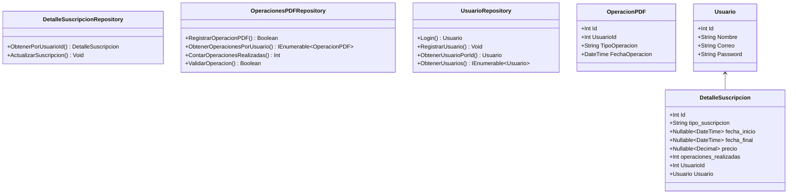

Diagrama de clases

Diagrama de casos de uso:

graph TD
    Usuario[Usuario] --> IniciarSesion[Iniciar sesión]
    Usuario --> CerrarSesion[Cerrar sesión]
    Usuario --> RegistrarNuevoUsuario[Registrar nuevo usuario]
    Usuario --> SubirArchivoPDF[Subir un archivo PDF]
    Usuario --> FusionarPDFs[Fusionar PDFs]
    Usuario --> CortarPDFs[Cortar PDFs]
    Usuario --> VisualizarPlanesSuscripcion[Visualizar planes de suscripción]
    Usuario --> ActualizarSuscripcion[Actualizar suscripción]

